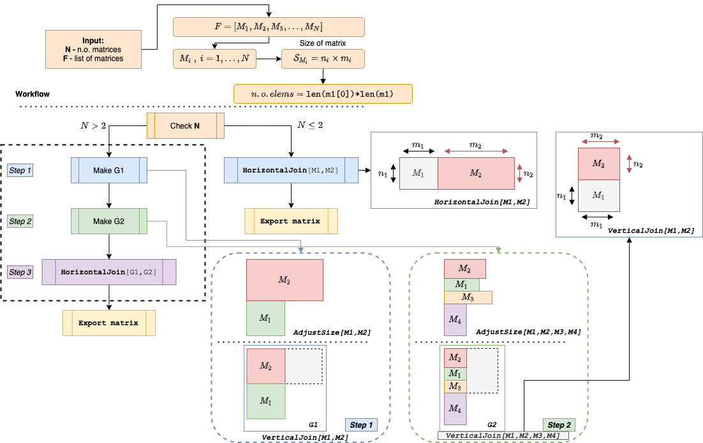

# Python Photo Collage

A simple python implementation for creating a photo collage (grid).

## Workflow

**V.1**: The current implementation is creating images from `NxM` sized arrays that are initialized with a random pixel color (that will serve as background).

* The matrices are created with random sizes (e.g., `N` and `M` are randomly chosen at *creation time*).
* Based on a *sort-by-size* procedure, decision for truncating each matrix is done, such that an optimal joining procedure for any two matrices is done properly. 
* Finally, a grid arrangement of all the obtained objects is done, with an export as a single unified matrix.

In terms of the grid arrangement, the first two matrices from the list will be joined (appended) vertically (e.g., on top of each other) after the size along OX axis (that is the *number of columns*) is properly adjusted for both matrices (group **G1**). For the remaining matrices within the list, another vertical joining procedure will be made, with a common size along OX axis has been determined (group **G2**). With **G1** and **G2** determined, a *horizontal joining* procedure is applied, making sure that the number of rows for the second group is exactly the same as the number of rows for the two initial matrices belonging to **G1**.

The diagram aims at depicting the workflow described above in a simplistic manner.

